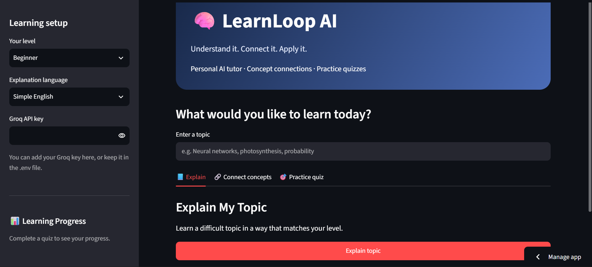

# LearnLoop AI

**Understand it. Connect it. Apply it.**

LearnLoop AI is a Streamlit app that works as a personal study tutor. Enter any topic, and it explains it at your level, maps how it connects to related ideas, and quizzes you on it. It then uses your quiz results to suggest what to study next.

It was built for ForgeHacks and uses the Groq API for all language model calls.

> **Live demo:** [scamshield-ai on Streamlit](https://learnloop-ai-oatyrgo8mhbz5krk2mouki.streamlit.app/)
>
> 

## Why this exists

Most students don't struggle because explanations are missing. They struggle because explanations don't match their level, don't show how ideas fit together, and don't check whether anything was actually understood. LearnLoop AI covers those three gaps in one loop: **explain, connect, practice**.

## Features

**Explain**
Generates a structured explanation of a topic: the idea in simple words, why it matters, a real-life example, key points, a common mistake, and a short check question. Any technical term is explained before it is used.

**Connect concepts**
Builds a small concept map for the topic: a central concept, five related concepts, four explicit relationships ("A connects to B because..."), and one analogy.

**Practice quiz**
Creates a multiple-choice quiz of 3, 5, or 7 questions. After you submit, you get a score, a per-question breakdown, the correct answers, and a short explanation for each.

**Progress tracking and study suggestions**
The sidebar shows quizzes completed and your average score for the current session. A "Suggest what I should study next" button sends your quiz history to the model and returns the weakest topic, why, what to study next, and one study tip.

**Level and language options**
Choose Beginner, Intermediate, or Advanced, and get explanations in Simple English, Bangla, or English + Bangla.

## How it works

1. You pick your level and language in the sidebar and enter a topic.
2. Each tab builds a task-specific prompt from the topic, level, and language, then sends it to a Groq-hosted model.
3. For the quiz, the model is instructed to return strict JSON. The app strips any code fences, parses it, and renders the questions as interactive radio buttons.
4. Scores are saved in Streamlit session state and reused for the progress panel and the study suggestion.

## Tech stack

- Python
- Streamlit
- Groq API (default model: `openai/gpt-oss-120b`)
- python-dotenv

## Getting started

### Prerequisites

- Python 3.10 or newer
- A Groq API key from [console.groq.com](https://console.groq.com)

### Installation

```bash
git clone https://github.com/<your-username>/<repo-name>.git
cd <repo-name>

python -m venv venv
source venv/bin/activate        # macOS / Linux
# venv\Scripts\activate         # Windows

pip install -r requirements.txt
```

### Configuration

Create a `.env` file in the project root:

```env
GROQ_API_KEY=your_api_key_here
GROQ_MODEL=openai/gpt-oss-120b   # optional, this is the default
```

You can also paste your key into the sidebar at runtime instead. Keep `.env` out of version control.

### Run

```bash
streamlit run app.py
```

Then open the local URL shown in the terminal.

## Project structure

```text
.
├── app.py              # the full Streamlit application
├── requirements.txt
└── .env                # your API key (not committed)
```

## Limitations

- **Answers come from a language model.** Explanations and quiz answers can be wrong. The tutor is prompted to admit uncertainty, but important facts should still be checked against a reliable source.
- **Quiz generation can occasionally fail.** The model sometimes returns malformed JSON. The app shows an error, and generating the quiz again usually fixes it.
- **Progress is not saved.** Quiz history lives in the browser session and resets when the page is refreshed or closed.
- **No automated tests yet.**

## Roadmap

- Save progress across sessions
- Validate quiz output against a schema and retry automatically on failure
- Add topic-level mastery tracking over time
- Support more explanation languages
- Add automated tests for quiz parsing and scoring

## Author

**Muhammad Sharafat Alam**
[GitHub](https://github.com/MuhammadSharafat) · [Portfolio](https://sharafatalam.netlify.app/)
